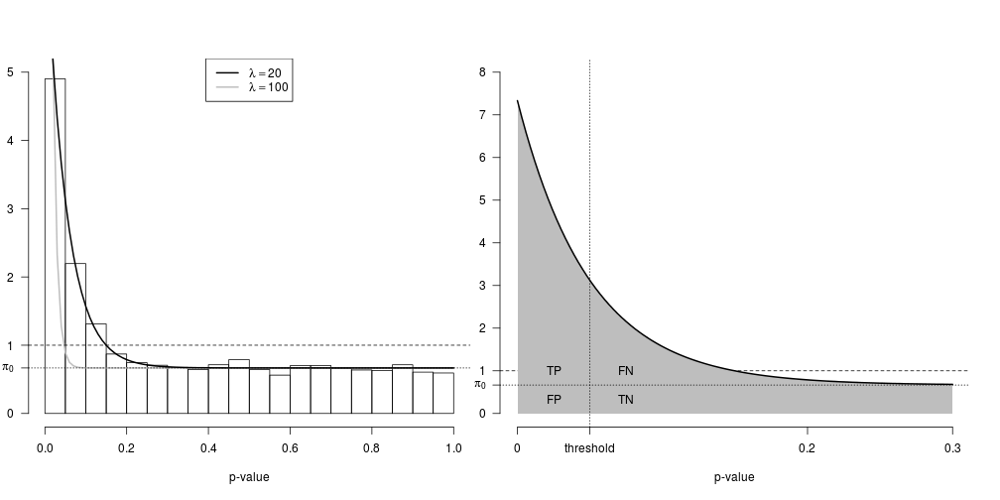

```r
source('errors.R')
```

## Appendix for **Statistical Overview**

Define probability densities

```r
pi1 <- 1/3; pi0 <- 1 - pi1
dpval1 <- dpval.maker(pi1=pi1, lambda=20)
dpval2 <- dpval.maker(pi1=pi1, lambda=100)
h1 <- hist(pval.sampler(dpval1, 3170), breaks=20, plot=FALSE)
par(mfrow=c(1,2))
par(mar = c(par('mar')[1], 2, par('mar')[3:4]))
# upper plot to recreate Fig. 1 of Storey & Tibshirani 2003
plot.new()
plot.window(xlim=0:1, ylim=c(0, h1.max <- ceiling(max(h1$density))))
axis(1)
axis(2, c(0:h1.max, pi0), c(0:h1.max, expression(pi[0])), las=1)
title(main='', xlab='p-value')
plot(h1, freq=FALSE, add=TRUE)
lines(x <- 0:100/100, dpval2(x), col='gray', lwd=2)
lines(x, dpval1(x), col='black', lwd=2)
abline(h=1, lty='dashed')
abline(h=pi0, lty='dotted')
legend('top', legend = c(expression(lambda==20), expression(lambda==100)), col=c('black', 'gray'), lwd=2)
# lower plot to illustrate the probability of (mis)classification events
par(mar = c(par('mar')[1], 0, par('mar')[3:4]))
plot.new()
plot.window(xlim=c(0,0.3), ylim=c(0, h1.max <- ceiling(dpval1(0))))
axis(1, c(0, thrs <- 5e-2, 0.2, 0.3), c(0, expression(threshold), 0.2, 0.3))
axis(2, c(0:h1.max, pi0), c(0:h1.max, expression(pi[0])), las=1)
title(main='', xlab='p-value')
abline(h=1, lty='dashed')
x <- 0:100/100*0.3; y <- dpval1(x)
polygon(x=c(x, 0.3, 0, 0), y=c(y, 0, 0, dpval1(0)), col='gray', border=NA)
lines(x, y, col='black', lwd=2)
abline(h=pi0, lty='dotted')
abline(v=thrs, lty='dotted')
text(rep(c(thrs/2, thrs*3/2), each=2), rep(c(pi0/2, pi0*3/2), times=2), c('FP', 'TP', 'TN', 'FN'))
```

 

Let us take the number of all genes = 2.5 &times; 10<sup>4</sup>.  With 200 number of imprinted genes suggested by DeVeale et al $\pi_1 =$ 
0.008.
With 1300 number of imprinted genes suggested by Gregg et al $\pi_1 =$ 0.052.

Calculate FDR for various cases

```r
get.error.rates(pi1=deveale$pi1, lambda=20, 1e-2)$fdr
```

```
## [1] 0.8724596
```

```r
get.error.rates(pi1=gregg$pi1, lambda=20, 1e-2)$fdr
```

```
## [1] 0.5014281
```

```r
get.error.rates(pi1=deveale$pi1, lambda=20, 1e-4)$fdr
```

```
## [1] 0.8612304
```

```r
get.error.rates(pi1=gregg$pi1, lambda=20, 1e-4)$fdr
```

```
## [1] 0.4771101
```

```r
get.error.rates(pi1=deveale$pi1, lambda=20, 1e-8)$fdr
```

```
## [1] 0.858653
```

```r
get.error.rates(pi1=gregg$pi1, lambda=20, 1e-8)$fdr
```

```
## [1] 0.4717742
```

```r
get.error.rates(pi1=deveale$pi1, lambda=2000, 1e-2)$fdr
```

```
## [1] 0.5535714
```

```r
get.error.rates(pi1=gregg$pi1, lambda=2000, 1e-2)$fdr
```

```
## [1] 0.1541965
```

```r
get.error.rates(pi1=deveale$pi1, lambda=2000, 1e-4)$fdr
```

```
## [1] 0.06402669
```

```r
get.error.rates(pi1=gregg$pi1, lambda=2000, 1e-4)$fdr
```

```
## [1] 0.009957146
```

```r
get.error.rates(pi1=deveale$pi1, lambda=2000, 1e-8)$fdr
```

```
## [1] 0.05838096
```

```r
get.error.rates(pi1=gregg$pi1, lambda=2000, 1e-8)$fdr
```

```
## [1] 0.009033134
```
