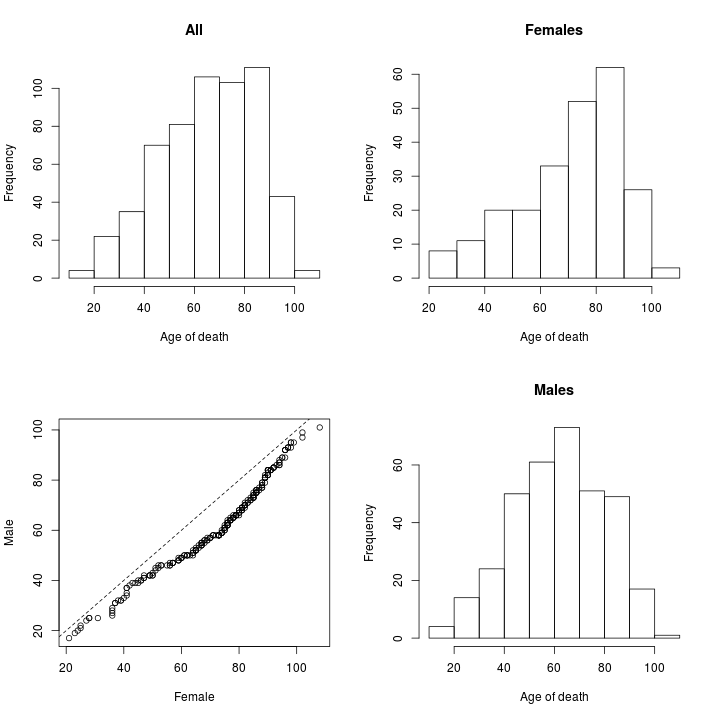
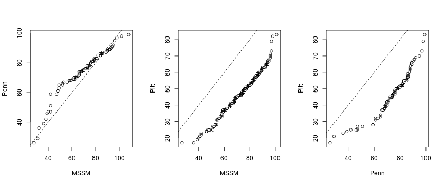
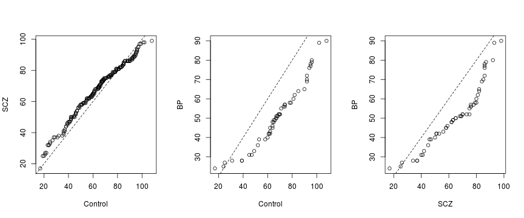
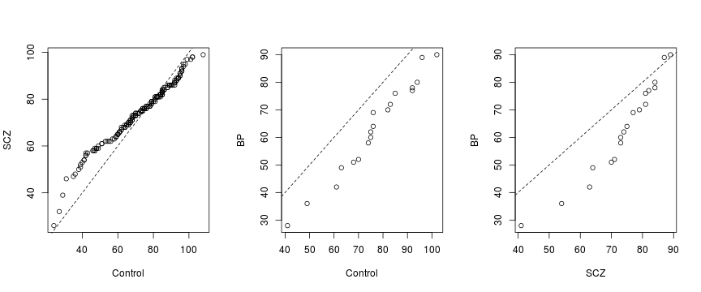

This is an explanatory, qualitative, analysis on the distribution of the age of death among the studied individuals  from the [CommonMind Consortium](http://commonmind.org/WP/).  The conclusion is that biological variables such as gender and psychiatric state do seem to affect age of death but such qualitative analysis is insufficient to confidently disentangle these biological variables from psychological, social, institutional, and other biomedical variables.

## Age of death and other variables

Load data on issue samples from human brains.  Each sample comes from a different individual.  Print variables characterizing individuals.

```r
csv <- '/home/attila/projects/monoallelic-brain/data/ifat/age-dependence/samples.csv'
samples <- read.csv(csv)
names(samples)
```

```
##  [1] "ID"                                               
##  [2] "Individual.ID"                                    
##  [3] "RNAseq_ID"                                        
##  [4] "DNA_report..Genotyping.Sample_ID"                 
##  [5] "Institution"                                      
##  [6] "Gender"                                           
##  [7] "Ethnicity"                                        
##  [8] "Age.of.Death"                                     
##  [9] "Dx"                                               
## [10] "DNA_isolation..Sample.DNA.ID"                     
## [11] "DNA_report..Genotyping.Sample_ID.1"               
## [12] "DLPFC_RNA_dissection..Institution.DLPFC.Sample.ID"
## [13] "FPKM_ID"                                          
## [14] "Ancestry.EV.1"                                    
## [15] "Ancestry.EV.2"                                    
## [16] "Ancestry.EV.3"                                    
## [17] "Ancestry.EV.4"                                    
## [18] "Ancestry.EV.5"                                    
## [19] "DLPFC_RNA_ID"
```
Here I select somewhat arbitrarily three variables (besides `Age.of.Death`): `Gender`, `Insitiution`, and psychiatric disease status `Dx`.

## Marginal and conditional age distributions

### Gender

Now examine age distribution. Start with marginal distribution and look at the conditional one given gender.

The upper left histogram shows the age (of death) distribution marginally, that is across all individuals.  The histograms on the right illustrate conditional distributions given the individual's gender.

 

The lower left graph is a [Q-Q plot](https://en.wikipedia.org/wiki/Q%E2%80%93Q_plot) (Q is for quantile). Q-Q plots in general compare the shape and scale of two distributions.  This
 specific Q-Q plot shows that for young individuals (<40) the rate of mortality is similar between sexes.  For older individuals, the age of death is skewed to the right (to higher values) in the case of women relative to men.  For very old individuals (>90) the gender gap appears smaller.  These results are in agreement with the well-known fact that "women tend to live longer" and suggest that there is an age window (roughly 40-90 years) in which men die at a higher rate than women.

### Institution

Age of death may be conditioned not only on gender but other variables.  Different institution may focus on different age groups or diseases with differing mortality rate.  Individuals were taken care of by three institutions:

```r
levels(samples$Institution)
```

```
## [1] "MSSM" "Penn" "Pitt"
```

The Q-Q plots below demonstrate that the *Pitt* (Pittsburgh) individuals tended to die much younger than those from the two other institutions.  This motivates including institution as an explanatory variable in later regression analyses to mitigate sampling bias.
 

### Psychiatric disease

Individuals fall in three groups with regards to psychiatric diseases:

```r
levels(samples$Dx)
```

```
## [1] "BP"      "Control" "SCZ"
```

The Q-Q plots show only a slight difference between schizophrenics *SCZ* and *Control* individuals but indicate a larger difference between the bipolar *BP* group compared to the other groups in that age of death for *BP* is relatively skewed to the left (lower age of death).
 

To what extent do these findings arise from a biological link between psychiatric condition and mortality or from a possible sampling bias mentioned above?  The Q-Q plots below address this question as they were prepared without the *Pitt* individuals (for which age is skewed to the left).  *BP* is still skewed relative to *SCZ* or *Control* but this looks now less significant because exclusion of *Pitt* strongly decreased the sample sizes (i.e. the number of individuals) based on which the middle and right plot was made.  On the other hand, the left plot suggests lower mortality rate for young schizophrenics *SCZ* young controls.  This finding is contrary to the expectation that schizophrenia promotes [suicidal tendencies](https://en.wikipedia.org/wiki/Suicidal_Tendencies) and alludes to complex interaction of psychological, social, biological and medical circumstances.
 
