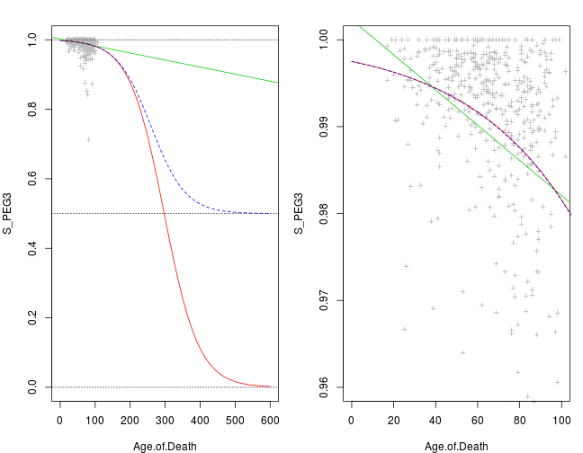
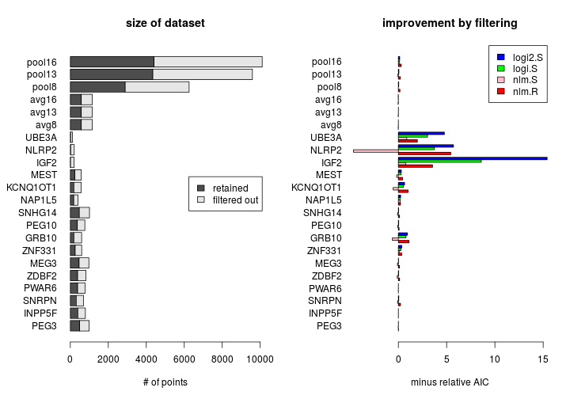
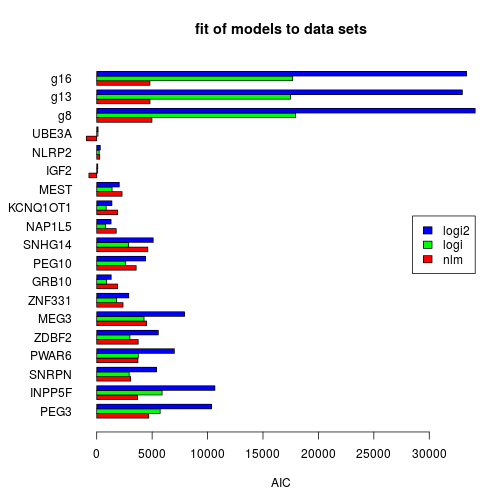
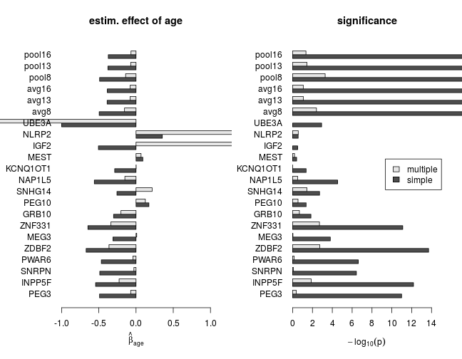
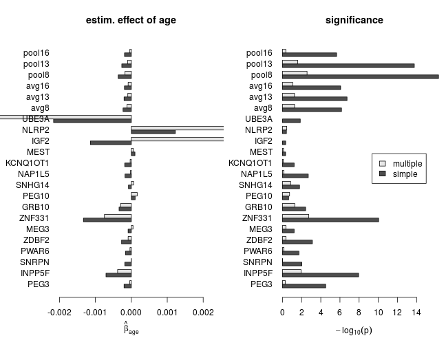
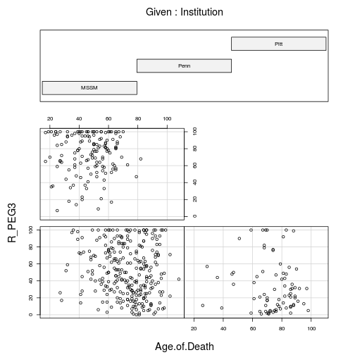
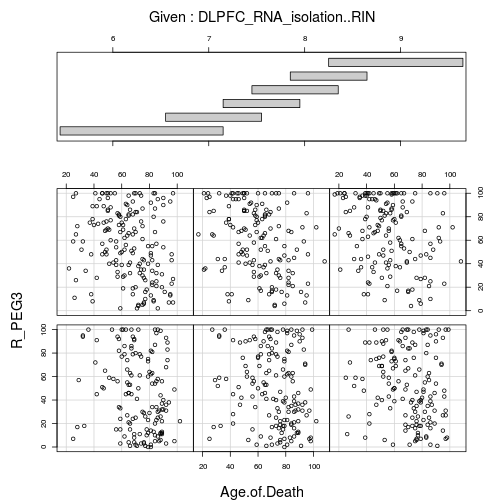
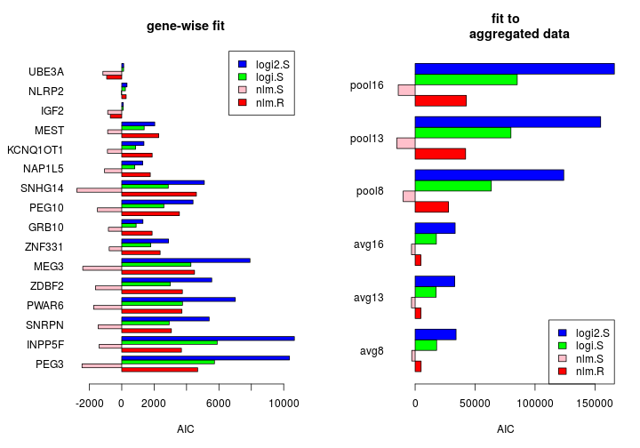

## Preparations

### Data

Data files:

```r
files <- list(S="pop_skew_3June15.txt",
              N="pop_cov_3June15.txt",
              X="DLPFC.ensembl.KNOWN_AND_SVA.ADJUST.SAMPLE_COVARIATES.tsv",
              X2="samples.csv")
```

File `S` contains the matrix $S=[s_{ig}]$ of the observed $s_{ig}$ statistic for all individuals $i$ and selected genes $g$. (The capitalized $S_{ig}$ denotes the corresponding random variable).  Similarly, `N` contains a matrix of total read counts $N_{ig}$, where "total" reflects summing over both alleles.  `X` contains the design matrix $X=[X_{ir}]$, where $r$ indexes *explanatory variables*. `X2` contains a subset of explanatory variables found in `X` but, unlike `X`, `X2` contains `RNAseq_ID`s that are used for mapping from $X$ to $S$ (and to $N$) and are absent from `X2`.

Selected gene sets of size $8, 13, 16$, sequentially nested in each other:

```r
             # 8 genes analyzed by Ifat
genes <- c("PEG3", "INPP5F", "SNRPN", "PWAR6", "ZDBF2", "MEG3", "ZNF331", "GRB10",
             # 5 more genes analyzed by AGK 3/2/16
             "PEG10", "SNHG14", "NAP1L5", "KCNQ1OT1", "MEST",
             # 3 more genes present in data files
             "IGF2", "NLRP2", "UBE3A")
```

Manipulations of $S$ and $N$ give rise to $response$ variables $Y=[y_{ig}]$ of
various regression models (below). These manipulations fall in the following
categories:

1. *filtering*: whether the $s_{ig}$ statistic is excluded for individual $i$ and gene $g$ if the total read count $N_{ig}\le 50$
1. *transformation*: whether $s_{ig}$ is transformed into a rank $r_{ig}$ for a given $g$ across all individuals $i$
1. *aggregation*: whether $s_{ig}$ or $r_{ig}$ are aggregated across genes based on gene sets of size $8, 13, 16$; aggregation may be achieved via
    1. *averaging* responses across genes
    1. *pooling* responses from multiple genes

Ifat's earlier work used only one set of manipulations: filtering + rank transformation + aggregation by averaging across the set of $8$ genes.  The resulting response variable was termed $\mathrm{LOI\_R}$ for "loss of imprinting ratio".  This term is avoided here because imprinting (or allelic imbalance) may increase with age for certain genes or sets of genes, and also because $r_{ig}$ is more concise than $\mathrm{LOI\_R}_{ig}$.

The explanatory variables $x_r \in X$ are

```r
expl.var <- c("`Age.of.Death`",
               "Institution",
               "Gender",
               "`PMI..in.hours.`",
               "Dx",
               "`DLPFC_RNA_isolation..RIN`", "`DLPFC_RNA_isolation..RIN.2`",
               "`DLPFC_RNA_report..Clustered.Library.Batch`",
               "`Ancestry.EV.1`", "`Ancestry.EV.2`", "`Ancestry.EV.3`", "`Ancestry.EV.4`", "`Ancestry.EV.5`" )
```
Note that there are additional variables in `X` but those are not included in the models, following Ifat's earlier work.

### Regression models

Three regression models are considered here: **nlm** (normal linear), **logi** (logistic) and **logi2** (scaled logistic). All three fit into the *generalized linear model* (glm) framework, and
characterized by

1. the *linear predictor* $\eta = \sum_r x_r \beta_r$, where $\beta_r$ are regression *coefficients* mediating the *effects* of $X$ on the response
1. the *link function*: a one to one mapping of $\eta$ onto the mean response $\mu\equiv \mathrm{E} Y$
1. $P(Y_i|\eta_i)$, the *conditional distribution of the response* given the predictor for observation (individual) $i$

For the logi and logi2 models the response, for each observation (individual) is distributed binomially and the denominator is used as weight for that observation.  Using $S_{ig}$ as response suggests using the corresponding observed $n_{ig}$ as weights.  In contrast the nlm model has linear link function and normal (Gaussian) response distribution; under this model the weight is uniformly 1 across observations (individuals) for single and pooled genes.  For averaged genes the weights are, as previously, also taken as uniformly 1.  In this case, however, a more rigorous treatment would be defining the weight at observation $i$ as the number $|G|_i$ of averaged genes at that $i$ since that number varies due to non-uniformly missing data and filtering.

The link functions are given by the following equations
$$
\begin{equation}
\mu = \eta \qquad \text{linear; nlm}
\end{equation}
$$
$$
\begin{equation}
\mu = \frac{1}{1 + e^{-\eta}} \qquad \text{logistic; logi}
\end{equation}
$$
$$
\begin{equation}
\mu = \frac{1}{2} + \frac{1}{2 (1 + e^{-\eta})} \qquad \text{scaled logistic; logi2}
\end{equation}
$$

These functions are illustrated by the following plot; nlm: solid green, logi: solid red, and logi2: dashed blue.  They reflect simple models with $S_{i\mathrm{PEG3}}$ as response and `Age.of.Death` as the only explanatory variable.  Thus there are two regression coefficients in all three cases, and these were estimated with iterative weighted least squares using `R`'s `glm` function.  logi and logi2 are almost indistinguishable in the range of all observed ages but become quite different around 300 years (much longer than the human lifespan).

 

Residual deviance (top) and AIC (bottom) as measures of fit.


```
##          nlm         logi        logi2 
## 2.028023e-01 5.484768e+03 1.127678e+04
```

```
##       nlm      logi     logi2 
## -2432.414  7116.834 13207.780
```

Although the models might appear freely combinable with both data transformations, it is not clear how logistic model(s) might be fitted after rank transformation of $S_{ig}$.  Because how should total read counts $n_{ig}$ (the weights) be transformed?  But the converse case is straight-forward: to fit nlm to untransformed $S_{ig}$ despite its apparent heteroscedasticity and nonlinearity (see [Ifat's plots][ifat] and the data exploration below).

The table summarizes the models' properties.

|                   |    nlm            |    logi           |       logi2       |
|:-----------------:|:-----------------:|:-----------------:|:-----------------:|
|    link function  |    linear         |    logistic       |  scaled logistic  |
|response distrib.  |normal (Gaussian)  |   binomial        |     binomial      |
|         response  |  $R_{ig}, S_{ig}$ |   $S_{ig}$        |   $S_{ig}$        |
|   weights         |      1 (uniform)  |   $n_{ig}$        |   $n_{ig}$        |

### Implementation

The multifaceted goals of the present analysis called for a completely *new implementation* of data manipulations and models because the earlier implementation (by Ifat) lacked the necessary modularity.  The script files for the new and old implementation:

```r
source('2016-04-22-glm-for-s-statistic.R')
source('../2016-03-02-ifats-regression-analysis/2016-03-02-ifats-regression-analysis.R')
```


The new script provides the function `nlm` for the nlm model, `logi` for logi, and `logi2` for logi2.  Additionally, the `nlm2` function also implements nlm, but instead of calling `R`'s `glm` function (which is also called by `logi` and `logi2`), it calls `lm`.   The definition of `logi2` is nearly identical to  `logi`; the only difference is using `C2` as response variable instead of `C`.  Wheres `C` contains the original observed "higher" and "lower" read counts, `C2` is a transformation of those that corresponds to the (inverse) scaling function of the logistic functiion in logi2.


```r
f <- list(
          nlm.R = function(y, d) { # normal linear model with rank R as response
              glm(formula = mk.form(paste0("R_", y)), family = gaussian, data = d)
          } ,
          nlm2.R = function(y, d) { # as above but with the R's lm function instead of glm
              lm(formula = mk.form(paste0("R_", y)), data = d)
          } ,
          nlm.S = function(y, d) { # normal linear model with S statistic as response
              glm(formula = mk.form(paste0("S_", y)), family = gaussian, data = d)
          } ,
          nlm2.S = function(y, d) { # as above but with the R's lm function instead of glm
              lm(formula = mk.form(paste0("S_", y)), data = d)
          } ,
          logi.S = function(y, d) { # logistic regression with the S statistic as response
              glm(formula = mk.form(paste0("C_", y)), family = binomial, data = d)
          } ,
          logi2.S = function(y, d) { # as above but with rescaled and offset logistic link function
              glm(formula = mk.form(paste0("C2_", y)), family = binomial, data = d)
          } )
```
As expected, all results with `nlm2` were found to be identical to `nlm` (not shown).

## Results

### Data exploration

The following plots explore the relationship between a given response variable and 12 of the 13 explanatory variables (the 13th one, Ancestry.EV.5 showed no systematic relationship and is omitted here so that plots can be arranged in $3 \times 4$ arrays).  In this document only filtered data are presented because filtering had no visually appreciable effect on the plot.

#### Responses averaged across genes

When the response is the average $\bar{S}_{i}=\left( \sum_g n_g \right)^{-1} \sum_{g=1}S_{ig} n_{ig}$ (below), a qualitatively similar, inverse, relationship emerges between $\bar{S}$ statistic and age as seen in [Ifat's plots][ifat], which depicted 13 genes separately.   Some of the remaining 11 explanatory variables, like Institution or PMI.in.hours seem to effect $\bar{S}$, while others like Gender don't.

 

When ranks are averaged as $\bar{R}_i=\sum_gR_{ig}$, the response appears more homoscedastic (its dispersion appears unaffected by explanatory variables) but some of the systematic effects that are seen without transformation (e.g. PMI.in.hours) are diminished.

 

#### Responses pooled across genes

The next set of plots shows data points for all genes pooled together rather than averaged together so each plot has many more points than before.  Below are plots with $s_{ig}$ as response for $g\in$ all 16 genes.

 

Below are plots with $r_{ig}$ (observed ranks) as response.  Compared to the corresponding results obtained with averaging there is clearly less systematic variation of the response with explanatory variables, which hints at their differential effects on various genes.

 

#### Response vs age for each gene separately

The differential effect of age on the response of various genes is illustrated now.
Plotted below is the observed $s_{ig}$ statistic versus age for each gene $g$ separately.  Dots are data points and the solid line is the smoothed data with the Lowess filter.  The lower percentile of $s_{ig}$, for each $g$, has been trimmed off to enhance clarity.  Judged from the smooth curves the effect of age appears quite small.  Still, gene-to-gene variation is apparent.

 

Below are similar plots to the ones above but now with $R$ as response (i.e. with rank-transformation).  The among genes variation is quite clear.

 

### Conditional dependence on age given other explanatory variables

The apparent dependence of the response on age is marginal in the sense that other explanatory variables are disregarded in the previous plots.  However, those other variables may induce spurious dependence between the response and age even if those are conditionally independent.  Therefore, the next two sets of plots are conditioned on one of two explanatory variables, `Institution` and the RNA quality measure `DLPFC_RNA_isolation..RIN`, that were found to exert highly significant effect in Ifat's earlier regression analysis.  `DLPFC_RNA_isolation..RIN.2` had also highly significant effect, but it correlates so tightly with `DLPFC_RNA_isolation..RIN` (Pearson corr. coef 1) that it carries no additional information.

Importantly, these plots below suggest that, at least for PEG3, the response's dependence on age is genuine and not due to confounding effects of other variables.

 

```
## 
##  Missing rows: 8, 13, 16, 17, 32, 54, 57, 59, 60, 66, 67, 68, 77, 79, 84, 100, 116, 122, 131, 142, 150, 161, 177, 189, 192, 194, 197, 205, 208, 212, 216, 219, 226, 234, 246, 251, 252, 264, 277, 279, 284, 285, 289, 300, 302, 311, 312, 321, 322, 339, 341, 347, 349, 350, 358, 359, 366, 369, 372, 376, 377, 384, 394, 409, 418, 423, 429, 432, 439, 445, 446, 451, 472, 475, 480, 490, 492, 508, 512, 513, 519, 520, 524, 532, 536, 554, 575
```

 

```
## 
##  Missing rows: 8, 13, 16, 17, 32, 54, 57, 59, 60, 66, 67, 68, 77, 79, 84, 100, 116, 122, 131, 142, 150, 161, 177, 189, 192, 194, 197, 205, 208, 212, 216, 219, 226, 234, 246, 251, 252, 264, 277, 279, 284, 285, 289, 300, 302, 311, 312, 321, 322, 339, 341, 347, 349, 350, 358, 359, 366, 369, 372, 376, 377, 384, 394, 409, 418, 423, 429, 432, 439, 445, 446, 451, 472, 475, 480, 490, 492, 508, 512, 513, 519, 520, 524, 532, 536, 554, 575
```

### Comparing implementations

Let's compare the normal linear model obtained with Ifat's implementation to that with the new implementation!  For consistency with Ifat's [previous results][ifat] the data manipulations are: filtering, rank-transformation, and averaging over $8$ selected genes.

```r
sapply( c("deviance", "aic", "coefficients"), function(s) all.equal(m.ifat.avg8[[s]], m$avg8$nlm.R[[s]]))
```

```
##                                deviance 
##  "Mean relative difference: 0.04045548" 
##                                     aic 
## "Mean relative difference: 0.004622527" 
##                            coefficients 
##  "Mean relative difference: 0.02769083"
```
These results show a close but not perfect match between the old and new implementation.  The slight discrepancy seems to be due to a rounding step in the old code, for which I found no justification and therefore omitted from the new implementation.

### Effect of filtering

The table lists the relative change in AIC induced by omission of filtering, defined as $(\mathrm{AIC}_{f1} - \mathrm{AIC}_{f0}) / \mathrm{AIC}_{f1}$, where $f1$ indicates filtering and $f0$ no filtering.

```
##             nlm.R     nlm.S    logi.S   logi2.S
## PEG3     -0.01880  0.015100 -3.52e-03 -3.53e-03
## INPP5F   -0.00204  0.002730 -3.60e-04 -4.62e-04
## SNRPN    -0.22500  0.082400 -4.35e-02 -4.85e-02
## PWAR6    -0.00558  0.006350 -6.90e-05 -7.54e-05
## ZDBF2    -0.12900  0.125000 -3.73e-02 -3.70e-02
## MEG3     -0.10800  0.096000 -2.23e-02 -2.21e-02
## ZNF331   -0.35300 -0.128000 -2.86e-01 -3.66e-01
## GRB10    -1.11000  0.629000 -7.95e-01 -9.46e-01
## PEG10    -0.08210  0.060200 -3.75e-02 -3.93e-02
## SNHG14   -0.12300  0.089200 -3.07e-02 -3.10e-02
## NAP1L5   -0.22300 -0.193000 -1.88e-01 -2.43e-01
## KCNQ1OT1 -1.01000  0.540000 -5.37e-01 -6.48e-01
## MEST     -0.44400  0.179000 -2.85e-01 -3.08e-01
## IGF2     -3.55000 -0.757000 -8.59e+00 -1.54e+01
## NLRP2    -5.43000  4.660000 -3.74e+00 -5.71e+00
## UBE3A    -1.97000 -0.875000 -3.03e+00 -4.77e+00
## avg8      0.01430  0.005920 -9.99e-05 -2.17e-04
## avg13     0.01710 -0.001680 -3.75e-03 -4.34e-03
## avg16     0.02860 -0.000266  1.43e-02  1.59e-02
## pool8    -0.16900  0.002850 -4.05e-02 -4.19e-02
## pool13   -0.21300  0.051700 -5.52e-02 -5.66e-02
## pool16   -0.30000 -0.095100 -1.33e-01 -1.43e-01
```
Filtering has small effect in most cases.  The exceptions are those genes for which filtering removed many points such as NLRP2 and IGF2 (169 and 149 points removed, respectively) in contrast with genes like PEG3 (only 8 points removed).

All results below were obtained with filtering.

### Comparing models

The figure compares all three model families using AIC
 

## Conclusion


[ifat]: https://docs.google.com/presentation/d/1YvpA1AJ-zzir1Iw0F25tO9x8gkSAzqaO4fjB7K3zBhE/
