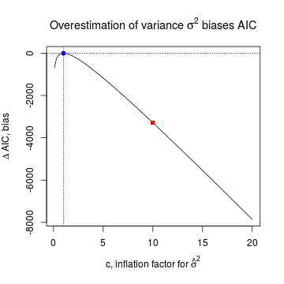
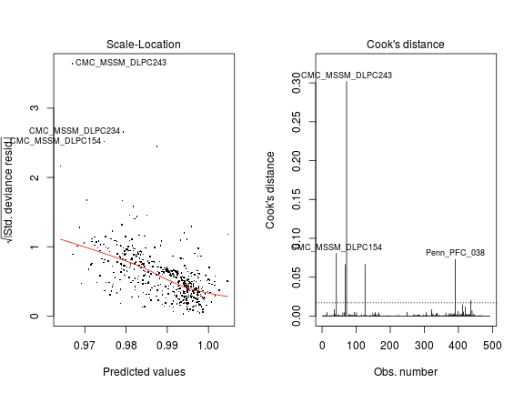
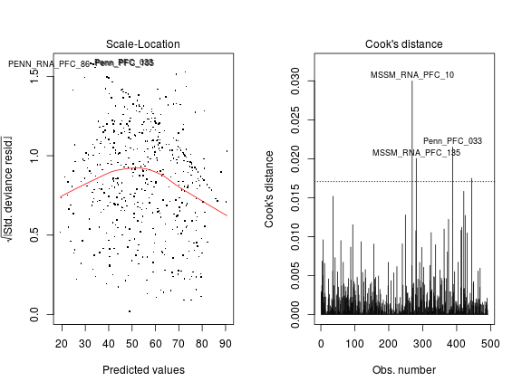
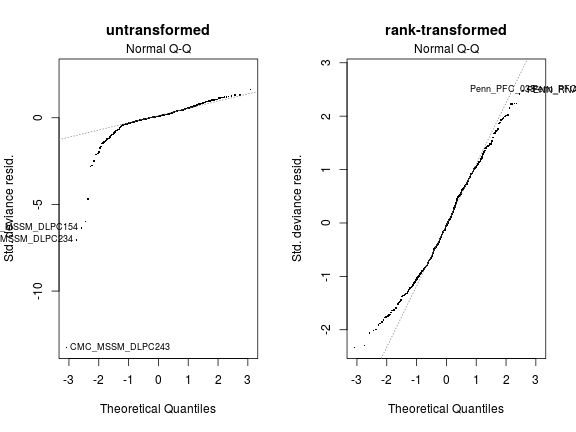

## Preparations


```r
source("../2016-04-22-glm-for-s-statistic/2016-04-22-glm-for-s-statistic.R")
source("../2016-04-22-glm-for-s-statistic/2016-04-22-glm-for-s-statistic-run.R")
source("../2016-04-22-glm-for-s-statistic/2016-04-22-glm-for-s-statistic-graphs.R")
```


```r
source("2016-05-07-comparing-regression-models.R")
```

## Comparing models using AIC

### AIC: criterion for model fit and parsimony

For any statistical model with parameter vector $\theta$ Akaike information criterion (AIC) is defined as
$$
\begin{equation}
\mathrm{AIC} = 2 \{ - \ell(\hat{\theta}) + p \}.
\end{equation}
$$
The first term $\ell(\hat{\theta})$ is the maximized log likelihood and quantifies how well the model fits the data (the higher $\ell$ the better fit).  Here $\hat{\theta}$ is the maximum likelihood estimate (m.l.e.) of $\theta$.  The second term $p$ is the number of parameters (i.e. the dimension of the vector $\theta$); the fewer parameters the model has the more parsimoniously it describes the data.  Thus models with better fit and more parsimony have smaller AIC.

Since $\ell$ is a negative function and $p\ge 1$, AIC must be positive.  However, the **estimated** AIC may be negative if the estimated $\ell$ is biased.

### Biased AICs for normal linear models

The figure compares all three model families using estimated AIC.  nlm.S, the normal linear model fit to untransformed $S_{ig}$ has negative AIC values indicating bias in the AIC estimation and casting doubt on the utility of such biased AIC values in model comparison.


The biased AIC is due to biased log-likelihood estimates.  For instance, the nlm.S fit to the PEG3 data has $\ell(\hat{\theta})=$ 1251 resulting in an estimated AIC of  -2455.  Such positive $\ell(\hat{\theta})$ is impossible unless it is massively overestimated.  Next I provide explanation and empirical evidence for such overestimation.

### An explanation for bias

#### Theory

For a normal linear model the parameters consist the regression coefficients $\beta$ and error variance $\sigma^2$ so $\theta=(\beta,\sigma^2)$.  Error in this context is the difference between the response $y_i$ and its predicted value $\hat{y}_i$ based on a fitted model.  The maximum likelihood estimates $\hat{\beta},\hat{\sigma}^2$ are the so-called least square estimates because they are obtained from minimizing the sum of squares $\mathrm{SS}(\beta)=(y-X\beta)^\top(y-X\beta)$ using the response $y=(y_1,...,y_n)$ of $n$ observations and the design matrix $X$ of explanatory variables.  In this case $y_i=S_{ig}$ (or $R_{ig}$ after rank transformation), and $i$ means individuals/tissue samples.  The log-likelihood for $\sigma^2$ with $\beta$ fixed at the least square estimate $\hat{\beta}$ is
$$
\begin{equation}
\ell(\hat{\beta},\sigma^2) = - \frac{1}{2} \left\{ n \log 2\pi + n \log \sigma^2 + \frac{1}{\sigma^2} \mathrm{SS}(\hat{\beta}) \right\}.
\end{equation}
$$

The m.l.e. for $\sigma$ is $n^{-1}\mathrm{SS}(\hat{\beta})$.  This is a good estimator when **the variance** of the errors **is constant** (across observations), which is one of the assumptions behind the nlm.  But when that assumption is violated, the sum of squares $\mathrm{SS}$ is inflated (since it is a quadratic function of the error terms) and therefore $\hat{\sigma}^2$ is inflated.  Suppose $\hat{\sigma}^2=c\sigma^2$, where $c>1$ is an inflation factor and $\sigma^2$ is the true variance.  Then the biased estimation of $\sigma^2$ also biases the estimated AIC by
$$
\begin{equation}
\Delta \mathrm{AIC}( c ) = - 2 \{ \ell(\hat{\beta},\hat{\sigma}^2) - \ell(\hat{\beta},\sigma^2) \} = n ( 1 + \log c - c ).
\end{equation}
$$

For example, $c=10$ corresponds to an order of magnitude inflation in estimated variance. Then $\mathrm{AIC}(10)=$ -3288 under the nlm.S model, indicated by the red square in the plot below.  A negative shift of this magnitude may readily explain why the estimated AIC is negative.  On the other hand $c=1$ means no inflation, in which case AIC is unbiased (blue square).



#### Empirical support

An indication that $\hat{\sigma}^2$ is largely inflated comes from the observation that it is close to the observed total variance of the response.  For example, when the nlm is fitted to the untransformed PEG3 data, $\hat{\sigma}^2=$ 3.64 &times; 10<sup>-4</sup>, only slightly smaller than the total variance of 4.28 &times; 10<sup>-4</sup>.

Still with PEG3 as an example, let's check the constant variance assumption behind the nlm!  The left panel shows strong *systematic variation* of the square root of standardized deviance (closely related to variance) with the predicted value of $S_{i\mathrm{PEG3}}$ for each individual $i$.  The right panel demonstrates several *extreme outliers*, like the tissue sample CMC_MSSM_DLPC243, whose impact on biasing the least square estimate $\hat{\sigma}^2$ is quantified by Cook's distance $C$.  A rule of thumb is that observations for which $C > 8 / (n - 2p)$ are "worth a closer look" (Davison: Statistical Models p395).  In this example $C$ for CMC_MSSM_DLPC243 and for several other observations greatly exceeds $8 / (n - 2p) =$ 0.0171, marked by the horizontal dashed line (right panel).



Thus, we see a strong systematic and non-systematic departures from constant variance assumed by normal linear models; this departure may be sufficient to explain the gross overestimation of the maximum log-likelihood.

### Rank transformation

Transformations in general may help achieve the assumptions made by normal linear models on the data.  The rank transformation dramatically improves the situation as shown below for PEG3.  There seems to be not much systematic variation of variance with predicted values (left panel) and Cook's distance for outliers does not greatly exceed the dashed line (right panel).



The rank transformation greatly improves also other properties of the data such as *normality* of errors, shown in the normal probability plots below (for PEG3; left panel: nml.S; right panel: nml.R).



Thus the normal linear model seems to fit well to the rank transformed data.  In agreement with this, the estimated AIC is plausibly positive under nlm.R; it is 4688, thus not far from 5725 under logi.S, that is the logistic model fitted on untransformed $S_{ig}$.  Based on the AIC for all 16 single gene fits, the nlm.R and logi.S models show comparable performance.

### Figure for manuscript

Top panels: untransformed $S$ statistic; bottom panels: $S$ rank-transformed into $R$


## Utility-based comparison

Model fit and parsimony are not the only criteria for comparing models.  In this section I examine the **utility** of model types pertaining to the following goals of the project:

1. detect significant effect of age on parental bias (i.e. significant "loss of imprinting")
1. quantify the effect size of age
1. improve classification by correcting for confounding explanatory variables (institution, RNA quality,...)

As we will see, different models have different limitations

### Limitations of nlm.R

The results above show that rank transformation, denoted here as $\rho$, is beneficial because the assumptions of the normal linear model are met in the case of rank transformed responses $\rho(S_{\cdot g})\equiv R_{\cdot g}$ but not in the case of untransformed $S_{\cdot g}$.  With rank transformation, however, **all information on effect size** (of age, for instance) **is lost**.  **Also lost** is any **information** on the baseline or average $S_{\cdot g}$, which is **essential for classifying** gene $g$ as mono or biallelically expressing.

The plots below illustrate this limitation of rank transformation.  Consider an affine transformation $\phi(S_{\cdot g}) = S_{\cdot g} / 3 + 1 / 3$ so that $\phi$ scales down the response by $1/3$ and shifts the baseline by $-1/3$ (compare upper left and right panels).  The downscaling of response simulates weakening effects of explanatory variables although somewhat unrealistically the variance of the error is also downscaled.  The negative shift in baseline simulates changing the class of a monoallelically expressed gene $g$ (in this case PEG3) to biallelically expressing.  But when rank transformation is applied to the two very different data sets shown on the top, all differences disappear (compare bottom left and right panels).


### Limitations of logistic models logi.S, logi2.S

For this point I will consider separately two classes of genes
* monoallelically expressed (including the 16 known imprinted genes in the present data)
* biallelically expressed

## Conclusions

TODO
