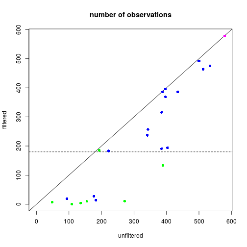
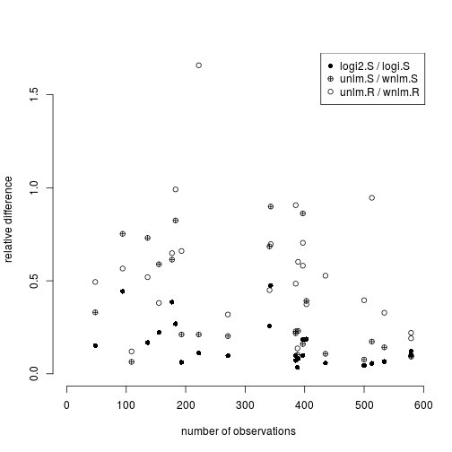

```r
library(ggplot2)
library(lattice)
library(latticeExtra)
```

```
## Loading required package: RColorBrewer
```

```
## 
## Attaching package: 'latticeExtra'
```

```
## The following object is masked from 'package:ggplot2':
## 
##     layer
```

## Changes in filtering

### The original filtering setup

Previous analysis set up two filters in order to reduce error by removing "noisy" or "weak" units of data; the principal difference between the two are the kind of data units they operate on:

1. observations $i$ (RNA samples/individuals)
1. genes $g$

Given gene $g$ filtering *observations* was done according to the total read count associated with each observation $N_{ig}$, using the rule that $i$ is filtered out if $N_{ig} \le 50$.  (Note that more generally $g$ may index a data set aggregated over a set of genes using for instance weighted or unweighted average aggregation method denoted as `WA` and `UA`, respectively).

Filtering for *genes* was then preformed using the rule that a gene be removed if the number of observations that passed the observational filter is $<180$: "We examined genes where we had greater than 180 analyzable individuals[...]" (see [manuscript]).

### What's new

#### Weighting instead of filtering observations

Filtering units in general can be considered as "all or none" weighting so that weight $w_{i}$ of unit $i$ is 1 if $i$ passed the filter and 0 otherwise.  It is theoretically beneficial to replace this crude weighting scheme with a more subtle one that uses finer grained weights because that way relatively strong observations that would be filtered out are still allowed to provide some information and, on the other hand, relatively week observations that would pass the filter have smaller impact on the results.

In the current application, given $i,g$, the total read count lends itself as a natural weight, so $w_{ig} = N_{ig}$.  Such weighting scheme is natural if we assume that the higher read count $H_{ig} = S_{ig} N_{ig}$ is binomial with denominator $N_{ig}$, which is the case for logistic regression `logi.S`. Under the normal linear regression model using $S_{g}$ and $R_g$ as response there is no such "natural" argument but it is still tempting and seemingly reasonable to use $N_{ig}$ as weight.  In the computational objects below this will be denoted as `wnlm.S` and `wnlm.R`, whereas no weighting will be labeled with `unlm.S` and `unlm.R`, respectively (see `fit-glms.R`).

#### Weighting genes instead of filtering them

The original rule for genes has little advantage if one recalls that fitting regression models provides standard errors and p-values for regression coefficients so that genes with sparse data will tend to be associated with large errors and insignificant results.  As we will see, all but one of the candidate imprinted genes would have to be removed under the $<180$ rule.

The only advantage of filtering out those genes was to prevent them from inflating the variance of $S_i$ (or $R_i$) in aggregated data sets that were obtained by unweighted averaging of $S_{ig}$ (or $R_{ig}$) over a gene set $\mathcal{G}$.  The new implementation of data import and processing (see `import-data.R`) introduces weighted average as a method of aggregating $S_{ig}$ for a set of genes.  Again, this is natural if $S_{ig}, \; g\in\mathcal{G}$ are assumed binomial with corresponding denominators $N_{ig}$ and, in addition, assumed to share $p_i \equiv p_{ig_1} = p_{ig_2} = ...$.  The new implementation also calculates the unweighted average `UA`, but the present analyses will be based only on `WA`.  This way, genes will affect the results from aggregated data sets in proportion with their contribution to those data.

## Extended data set

Load functions...

```r
source("~/projects/monoallelic-brain/src/import-data.R")
source("~/projects/monoallelic-brain/src/fit-glms.R")
```

**Obsolete**: Select the following (candidate) imprinted genes:

```r
             # 8 genes analyzed by Ifat
gene.ids <- c("PEG3", "INPP5F", "SNRPN", "PWAR6", "ZDBF2", "MEG3", "ZNF331", "GRB10",
             # 5 more genes analyzed by AGK 3/2/16
             "PEG10", "SNHG14", "NAP1L5", "KCNQ1OT1", "MEST",
             # 3 more genes present in data files
             "IGF2", "NLRP2", "UBE3A",
             # 'green' novel 1 MB imprinted genes; note that PWAR6 is already included above
             "TMEM261P1", "AL132709.5", "RP11-909M7.3", "SNORD116-20", "RP13-487P22.1", "hsa-mir-335", "PWRN1")
```


**Update** following readjustment of calling monoallelic genes (in a later post) select these genes:

```r
gene.ids <- unlist(read.csv("../../data/genes.regression.new", as.is = TRUE))
names(gene.ids) <- gene.ids
```


Get data: observations on predictors (explanatory variables) and on the higher and lower read count from selected genes (more details in a previous post)

```r
E <- get.predictors() # default arguments
Y <- get.readcounts(gene.ids = gene.ids, count.thrs = 0)
Y.f <- get.readcounts(gene.ids = gene.ids, count.thrs = 50)
```

### The number of available observations


The number of available observations is closely (and inversely) related to the standard error of estimated regression coefficients such as of $\hat{\beta}_\mathrm{age}$, on which our attention is centered. The number of observations before and after filtering at total read count threshold $\le 50$)...

```r
(nobs <- as.data.frame(lapply(list(unfiltered=Y, filtered=Y.f), function(y) sapply(y, function(x) sum(! is.na(x[[1]]))))))
```

```
##               unfiltered filtered
## MAGEL2               184        1
## TMEM261P1            109        0
## SNHG14               534      475
## AL132709.5           389      133
## RP11-909M7.3         271       11
## ZIM2                 240      223
## NAP1L5               222      183
## MEG3                 513      464
## PEG3                 500      492
## PWAR6                388      386
## FAM50B               120       12
## NDN                   88       65
## SNURF                297      285
## PEG10                397      369
## SNRPN                385      316
## KCNQ1OT1             385      191
## ZDBF2                435      386
## GRB10                403      194
## SNORD116-20          193      185
## KCNK9                242        1
## INPP5F               397      396
## RP13-487P22.1         48        7
## MEST                 341      237
## ZNF331               343      257
## hsa-mir-335          136        4
## DIRAS3                44        0
## PWRN1                155       10
## IGF2                 183       14
## NLRP2                177       28
## UBE3A                 94       19
## WA.8                 577      566
## WA                   579      579
## UA.8                 577      560
## UA                   579      578
```
which shows that the largest trade-off of filtering arises for genes for which the number of observations is ab ovo small, in particular for most genes in the "novel 1 MB" category.  The same information is plotted below; *blue* denotes known imprinted genes, *green* candidate imprinted genes (<1 MB) and *magenta* two gene sets aggregated by weighted average (`WA.8` and `WA`, overlapping each other).  The horizontal dashed line shows the filtering threshold of 180 observations that was defined previously to remove genes with little data.



#### Conclusion

The above results show that the previously used gene filter would remove 6 out of the 7 candidate genes with which the analysis now is extended.  This points to one of the benefits of the new weighting schemes introduced above.

### Apparent age dependence of $S_g$ for candidate genes $g$


## Estimation of regression coefficients

### Fitting models

Fitting all models to all retained gene-wise and aggregated read count data sets

```r
# exclude unweighed aggregates UA.8 and UA from fitting
to.fit.ids <- grep("^UA(.8)?$", names(Y), value = TRUE, invert = TRUE)
M <- do.all.fits(Y[to.fit.ids], preds = e.vars)
```

```
## Warning: glm.fit: algorithm did not converge
```

```
## Warning: glm.fit: fitted probabilities numerically 0 or 1 occurred

## Warning: glm.fit: fitted probabilities numerically 0 or 1 occurred
```

```
## Warning: glm.fit: algorithm did not converge
```

```
## Warning: glm.fit: fitted probabilities numerically 0 or 1 occurred

## Warning: glm.fit: fitted probabilities numerically 0 or 1 occurred
```

The following models have been fit...

```r
names(M)
```

```
## [1] "unlm.R"  "wnlm.R"  "unlm.S"  "wnlm.S"  "logi.S"  "logi2.S"
```
...to the following data sets

```r
names(M[[1]])
```

```
##  [1] "MAGEL2"        "TMEM261P1"     "SNHG14"        "AL132709.5"   
##  [5] "RP11-909M7.3"  "ZIM2"          "NAP1L5"        "MEG3"         
##  [9] "PEG3"          "PWAR6"         "FAM50B"        "NDN"          
## [13] "SNURF"         "PEG10"         "SNRPN"         "KCNQ1OT1"     
## [17] "ZDBF2"         "GRB10"         "SNORD116-20"   "KCNK9"        
## [21] "INPP5F"        "RP13-487P22.1" "MEST"          "ZNF331"       
## [25] "hsa-mir-335"   "DIRAS3"        "PWRN1"         "IGF2"         
## [29] "NLRP2"         "UBE3A"         "WA.8"          "WA"
```

The warnings arising during the fit also reflect the fact that for TMEM261P1 the fit failed to converge both under `logi.S` and `logi2.S`, so let

```r
f.ids <- as.data.frame(lapply(M, function(m) ! sapply(m, is.null)))
f.ids["TMEM261P1", c("logi.S", "logi2.S")] <- FALSE
```
Note that potential `NULL` results reflect genes that have been filtered out---by default none.

### Regression coefficient $\beta_\mathrm{age}$ 

#### Logistic model

Under the `logi.S` model $\beta_\mathrm{age}$ seems to vary greatly accross genes suggesting both gain or loss of imprinting with age or no effect of age.  Genes with fewer observations (as typical for candidate imprinted genes) have broad confidence intervals and so tend support the null hypothesis of $\beta_\mathrm{age}=0$ at a given significance level $\alpha$.  Aggregating read counts using weighted average is hugely beneficial as evidenced by dramatically shrunken confidence intervals (`WA.8`, `WA`) because the logistic model takes advantage of the increased total read counts.  The following pair of plots (obtained with the `lattice` and `ggplot2` package, respectively) illustrate these result:


#### Normal linear model on rank-transformed data

Under the `wnlm.R` model the above picture slightly changes.  In general, confidence intervals are broader than under `logi.S`. In particular, the normal linear model fails to benefit from data aggregation by ignoring total read counts; therefore the confidence intervals for `WA.8` or `WA` are *not* shrunken relative to single-gene data sets under this model.  The `lattice` and `ggplot2` implementation, as above:


### Comparing $\beta_\mathrm{age}$ from different models

#### Consistency between `wnlm.R` and `logi.S`


#### Impact of S rescaling (`logi2.S`) and of weighting observations (`nlm`)

Let $M' / M$ denote the comparison of two models in terms of the mean absolute difference of regression coefficients under $M'$ relative to $M$ for a given gene or aggregate $g$, defined as
$$
\frac{\sum_j | \beta'_{jg} - \beta_{jg} | }{\sum_j | \beta_{jg} | }
$$
where $\{\beta_{jg} : j=1,..,p\}$ and $\{\beta'_{jg} : j=1,..,p\}$ is a set of $p$ regression coefficients under $M$ and $M'$, respectively.

The plot below shows such differences for three model comparisons and all genes and aggregates.  Two systematic trends be seen:

1. the difference tends to decrease with increasing number of observations indicating that some of the difference comes from sampling error due to limited number of observations
1. the `logi2.S` / `logi.S` differences (both can be considered weighted averages) tend to be smaller than the differences between weighed and unweighted averaging of $\{S_{g}\}_g$ and especially that of $\{R_{g}\}_g$.



[manuscript]: https://docs.google.com/document/d/1cWd4UH98SJR5lihDihC0ZO-C_A1-8MQ5COcixxCLzHE/edit
