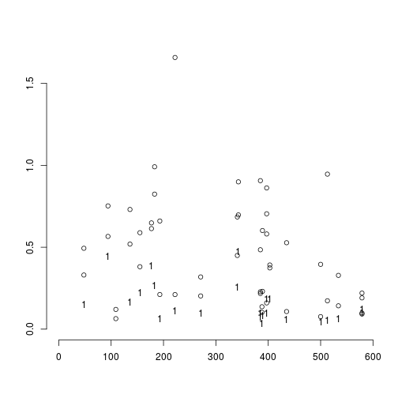

## Changes in filtering

### The original filtering setup

Previous analysis set up two filters in order to reduce error by removing "noisy" or "weak" units of data; the principal difference between the two are the kind of data units they operate on:

1. observations $i$ (RNA samples/individuals)
1. genes $g$

Given gene $g$ filtering *observations* was done according to the total read count associated with each observation $N_{ig}$, using the rule that $i$ is filtered out if $N_{ig} \le 50$.  (Note that more generally $g$ may index a data set aggregated over a set of genes using for instance weighted or unweighted average aggregation method denoted as `WA` and `UA`, respectively).

Filtering for *genes* was then preformed using the rule that a gene be removed if the number of observations that passed the observational filter is $<180$: "We examined genes where we had greater than 180 analyzable individuals[...]" (see [manuscript]).

### What's new

#### Weighting instead of filtering observations

Filtering units in general can be considered as "all or none" weighting so that weight $w_{i}$ of unit $i$ is 1 if $i$ passed the filter and 0 otherwise.  It is theoretically beneficial to replace this crude weighting scheme with a more subtle one that uses finer grained weights because that way relatively strong observations that would be filtered out are still allowed to provide some information and, on the other hand, relatively week observations that would pass the filter have smaller impact on the results.

In the current application, given $i,g$, the total read count lends itself as a natural weight, so $w_{ig} = N_{ig}$.  Such weighting scheme is natural if we assume that $S_{ig}$ is binomial with denominator $N_{ig}$, which is the case for logistic regression `logi.S`. Under the normal linear regression model using $S_{g}$ and $R_g$ as response there is no such "natural" argument but it is still tempting and seemingly reasonable to use $N_{ig}$ as weight.  In the computational objects below this will be denoted as `wnlm.S` and `wnlm.R`, whereas no weighting will be labeled with `unlm.S` and `unlm.R`, respectively (see `fit-glms.R`).

#### Weighting genes instead of filtering them

The original rule for genes has little advantage if one recalls that fitting regression models provides standard errors and p-values for regression coefficients so that genes with sparse data will tend to be associated with large errors and insignificant results.  As we will see, all but one of the candidate imprinted genes would have to be removed under the $<180$ rule.

The only advantage of filtering out those genes was to prevent them from inflating the variance of $S_i$ (or $R_i$) in aggregated data sets that were obtained by unweighted averaging of $S_{ig}$ (or $R_{ig}$) over a gene set $\mathcal{G}$.  The new implementation of data import and processing (see `import-data.R`) introduces weighted average as a method of aggregating $S_{ig}$ for a set of genes.  Again, this is natural if $S_{ig}, \; g\in\mathcal{G}$ are assumed binomial with corresponding denominators $N_{ig}$ and, in addition, assumed to share $p_i \equiv p_{ig_1} = p_{ig_2} = ...$.  The new implementation also calculates the unweighted average `UA`, but the present analyses will be based only on `WA`.  This way, genes will affect the results from aggregated data sets in proportion with their contribution to those data.

## Extended data set

Load functions...

```r
source("~/projects/monoallelic-brain/src/import-data.R")
source("~/projects/monoallelic-brain/src/fit-glms.R")
```

Select the following (candidate) imprinted genes:

```r
             # 8 genes analyzed by Ifat
gene.ids <- c("PEG3", "INPP5F", "SNRPN", "PWAR6", "ZDBF2", "MEG3", "ZNF331", "GRB10",
             # 5 more genes analyzed by AGK 3/2/16
             "PEG10", "SNHG14", "NAP1L5", "KCNQ1OT1", "MEST",
             # 3 more genes present in data files
             "IGF2", "NLRP2", "UBE3A",
             # 'green' novel 1 MB imprinted genes; note that PWAR6 is already included above
             "TMEM261P1", "AL132709.5", "RP11-909M7.3", "SNORD116-20", "RP13-487P22.1", "hsa-mir-335", "PWRN1")
```


Get data: observations on predictors (explanatory variables) and on the higher and lower read count from selected genes (more details in a previous post)

```r
E <- get.predictors() # default arguments
Y <- get.readcounts(gene.ids = gene.ids, count.thrs = 0)
Y.f <- get.readcounts(gene.ids = gene.ids, count.thrs = 50)
#Y <- list(f0 = # do not filter out observations
#          get.readcounts(gene.ids = gene.ids, count.thrs = 0),
#          f50 = # filter at count threshold 50 
#          get.readcounts(gene.ids = gene.ids, count.thrs = 50))
```

### The number of available observations

The number of available observations is closely (and inversely) related to the standard error of estimated regression coefficients such as of $\hat{\beta}_\mathrm{age}$, on which our attention is centered. The number of observations before and after filtering at total read count threshold $\le 50$):

```r
(nobs <- as.data.frame(lapply(list(unfiltered=Y, filtered=Y.f), function(y) sapply(y[ gene.ids ], function(x) sum(! is.na(x[[1]]))))))
```

```
##               unfiltered filtered
## PEG3                 500      492
## INPP5F               397      396
## SNRPN                385      316
## PWAR6                388      386
## ZDBF2                435      386
## MEG3                 513      464
## ZNF331               343      257
## GRB10                403      194
## PEG10                397      369
## SNHG14               534      475
## NAP1L5               222      183
## KCNQ1OT1             385      191
## MEST                 341      237
## IGF2                 183       14
## NLRP2                177       28
## UBE3A                 94       19
## TMEM261P1            109        0
## AL132709.5           389      133
## RP11-909M7.3         271       11
## SNORD116-20          193      185
## RP13-487P22.1         48        7
## hsa-mir-335          136        4
## PWRN1                155       10
```
This shows that the largest trade-off of filtering arises for genes for which the number of observations is ab ovo small, in particular for most genes in the "novel 1 MB" category.


```r
plot(nobs$unfiltered, nobs$filtered, xlim = c(0, nrow(E)), ylim = c(0, nrow(E)), pch = 16,
     main = "number of observations", xlab = "unfiltered", ylab = "filtered")
abline(0, 1)
```


## Estimation of regression coefficients

Fitting all models to all retained gene-wise and aggregated read count data sets

```r
M <- do.all.fits(Y[ids4fit])
```

```
## Warning: glm.fit: algorithm did not converge
```

```
## Warning: glm.fit: fitted probabilities numerically 0 or 1 occurred
```

```
## Warning: glm.fit: algorithm did not converge
```

```
## Warning: glm.fit: fitted probabilities numerically 0 or 1 occurred
```

The following models have been fit...

```r
names(M)
```

```
## [1] "unlm.R"  "wnlm.R"  "unlm.S"  "wnlm.S"  "logi.S"  "logi2.S"
```
...to the following data sets

```r
names(M[[1]])
```

```
##  [1] "PEG3"          "INPP5F"        "SNRPN"         "PWAR6"        
##  [5] "ZDBF2"         "MEG3"          "ZNF331"        "GRB10"        
##  [9] "PEG10"         "SNHG14"        "NAP1L5"        "KCNQ1OT1"     
## [13] "MEST"          "IGF2"          "NLRP2"         "UBE3A"        
## [17] "TMEM261P1"     "AL132709.5"    "RP11-909M7.3"  "SNORD116-20"  
## [21] "RP13-487P22.1" "hsa-mir-335"   "PWRN1"         "WA.8"         
## [25] "WA"
```


The warnings arising during the fit also reflect the fact that for TMEM261P1 the fit failed to converge both under `logi.S` and `logi2.S`, so let

```r
f.ids <- as.data.frame(lapply(M, function(m) ! sapply(m, is.null)))
f.ids["TMEM261P1", c("logi.S", "logi2.S")] <- FALSE
```
Note that `NULL` results reflect genes that have been filtered out---by default none.

Regression coefficients under logistic model fitted on $S$


```r
plot.betas(coefs4plot(M$logi.S[f.ids$logi.S]))
```


```r
plot.betas(coefs4plot(M$wnlm.R)) # [f.ids$wnlm.R] subscript to R can be omitted
```


The mean absolute difference of regression coefficients under `logi2.S` relative to `logi.S` is calculated for each gene or aggregate.
The difference tends to decrease with increasing number of observations for any given gene (or aggregate)

```r
mrds <- list(logi =
             sapply(names(M$logi.S[f.ids$logi.S]), function(x) mean.rel.diff(coef(M$logi.S[[x]]), coef(M$logi2.S[[x]]))),
         nlm.S = 
             sapply(names(M$wnlm.S[f.ids$wnlm.S]), function(x) mean.rel.diff(coef(M$wnlm.S[[x]]), coef(M$unlm.S[[x]]))))
plot(nobs <- sapply(names(mrds$logi), function(x) sum(! is.na(Y[[x]][[1]]))), mrds$logi,
     xlab = "number of observations", ylab = "mean abs. re. difference", add = TRUE)
```

```
## Warning in plot.window(...): "add" is not a graphical parameter
```

```
## Warning in plot.xy(xy, type, ...): "add" is not a graphical parameter
```

```
## Warning in axis(side = side, at = at, labels = labels, ...): "add" is not a
## graphical parameter

## Warning in axis(side = side, at = at, labels = labels, ...): "add" is not a
## graphical parameter
```

```
## Warning in box(...): "add" is not a graphical parameter
```

```
## Warning in title(...): "add" is not a graphical parameter
```



```r
lines(sapply(names(mrds$mrds$nlm.S), function(x) sum(! is.na(Y[[x]][[1]]))), mrds$nlm.S, pch = "+")
```

```
## Error in xy.coords(x, y): 'x' and 'y' lengths differ
```


## ANOVA

[manuscript]: https://docs.google.com/document/d/1cWd4UH98SJR5lihDihC0ZO-C_A1-8MQ5COcixxCLzHE/edit
