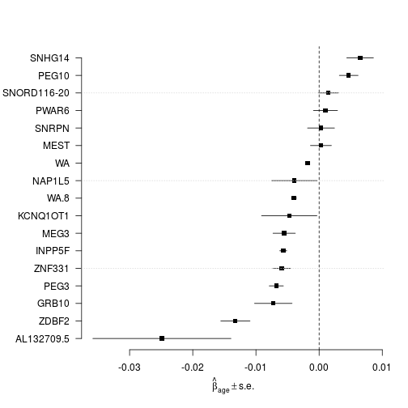
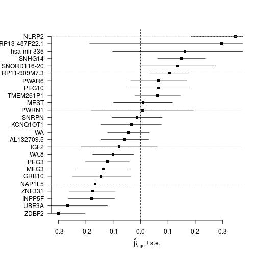

## Extended data set

Load functions...

```r
source("~/projects/monoallelic-brain/src/import-data.R")
source("~/projects/monoallelic-brain/src/fit-glms.R")
```

Select the following (candidate) imprinted genes:

```r
             # 8 genes analyzed by Ifat
gene.ids <- c("PEG3", "INPP5F", "SNRPN", "PWAR6", "ZDBF2", "MEG3", "ZNF331", "GRB10",
             # 5 more genes analyzed by AGK 3/2/16
             "PEG10", "SNHG14", "NAP1L5", "KCNQ1OT1", "MEST",
             # 3 more genes present in data files
             "IGF2", "NLRP2", "UBE3A",
             # 'green' novel 1 MB imprinted genes; note that PWAR6 is already included above
             "TMEM261P1", "AL132709.5", "RP11-909M7.3", "SNORD116-20", "RP13-487P22.1", "hsa-mir-335", "PWRN1")
```


Get data: observations on predictors (explanatory variables) and on the higher and lower read count from selected genes (more details in a previous post)

```r
# default arguments given explictely to both function calls
E <- get.predictors()
Y <- get.readcounts(gene.ids = gene.ids)
```

### The number of available observations

The number of available observations is closely (and inversely) related to the standard error of estimated regression coefficients such as of $\hat{\beta}_\mathrm{age}$, on which our attention is centered. Sorting genes (and aggregated gene sets) on the number of available observations on read counts (after filtering out observations with total read count $\le 50$):

```r
sort(sapply(Y[gene.ids], function(y) sum(! is.na(y[[1]]))))
```

```
##     TMEM261P1   hsa-mir-335 RP13-487P22.1         PWRN1  RP11-909M7.3 
##             0             4             7            10            11 
##          IGF2         UBE3A         NLRP2    AL132709.5        NAP1L5 
##            14            19            28           133           183 
##   SNORD116-20      KCNQ1OT1         GRB10          MEST        ZNF331 
##           185           191           194           237           257 
##         SNRPN         PEG10         PWAR6         ZDBF2        INPP5F 
##           316           369           386           386           396 
##          MEG3        SNHG14          PEG3 
##           464           475           492
```
This shows that very few observations are available for most genes in the "novel 1 MB" category.  In particular:

```
##     TMEM261P1   hsa-mir-335 RP13-487P22.1         PWRN1  RP11-909M7.3 
##             0             4             7            10            11 
##    AL132709.5   SNORD116-20 
##           133           185
```

The [manuscript] by Ifat et al reports they "examined genes where we had greater than 180 analyzable individuals" (after the filtering step mentioned above).  So, setting the threshold on minimum number of available observations $t=180$ retains only SNORD116-20 from this category while setting $t=100$, say, also retains AL132709.5, therefore this latter setting will be used in subsequent calculations:

```r
( excl.genes <- gene.ids[ which(sapply(Y[gene.ids], function(y) sum(! is.na(y[[1]]))) <= 100) ] )
```

```
## [1] "IGF2"          "NLRP2"         "UBE3A"         "TMEM261P1"    
## [5] "RP11-909M7.3"  "RP13-487P22.1" "hsa-mir-335"   "PWRN1"
```

## Estimation of regression coefficients

Fitting all models to all retained gene-wise and aggregated read count data sets

```r
M <- do.all.fits(Y[ setdiff(names(Y), excl.genes) ])
```


```r
names(M)
```

```
## [1] "nlm.R"   "nlm.S"   "logi.S"  "logi2.S"
```

Regression coefficients under logistic model fitted on $$S$$


```r
plot.betas(coefs4plot(M$logi.S))
```




```r
plot.betas(coefs4plot(M$nlm.R))
```



## ANOVA

[manuscript]: https://docs.google.com/document/d/1cWd4UH98SJR5lihDihC0ZO-C_A1-8MQ5COcixxCLzHE/edit
