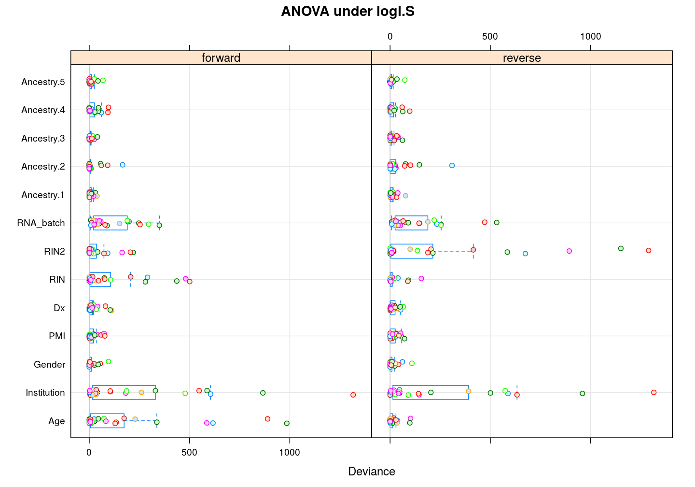

## Introduction

ANOVA and effects were used before...TODO

The least square estimates are given by $\hat{\beta} = (X^T X)^{-1} X^T y$.  Permuting the coefficients is equivalent to permuting the bases of the linear transformation $(X^T X)^{-1} X^T$ or, equivalently, permuting the *rows* of the corresponding matrix or, equivalently again, permuting the *columns* of the design matrix.  Therefore, when explanatory variables are reordered and the columns of the design matrix are permuted accordingly then the least square estimates still remain the same up to their relative order.

Take two permutations of explanatory variables:

1. **forward** has been used in all my and Ifat's previous analysis
2. the **reverse** of the above


## Preparation

Relevant scripts

```r
source("~/projects/monoallelic-brain/src/import-data.R")
source("~/projects/monoallelic-brain/src/fit-glms.R")
```

Import data

```r
E <- get.predictors() # default arguments
Y <- get.readcounts(gene.ids = gene.ids, count.thrs = 0)
#nobs <- as.data.frame(lapply(list(unfiltered=Y, filtered=Y.f), function(y) sapply(y, function(x) sum(! is.na(x[[1]])))))
```

Fit both `wnlm.R` and `logi.S` using both the forward and the reverse order permutation.

```r
e.v <- list(forward = e.vars, reverse = rev(e.vars))
# exclude unweighed aggregates UA.8 and UA from fitting
to.fit.ids <- grep("^UA(.8)?$", names(Y), value = TRUE, invert = TRUE)
M <- lapply(list(wnlm.R = "wnlm.R", logi.S = "logi.S"),
            function(m) lapply(e.v,
                               function(v) do.all.fits(Y[to.fit.ids], preds = v, sel.models = m)[[1]]))
# a list of (sub)lists mirrioring the structure of M (sublists: forward or reverse)
f.ids <- lapply(M, lapply, function(m) ! sapply(m, is.null))
# the fit for TMEM261P1 has not converged under logi.S
f.ids$logi.S$forward["TMEM261P1"] <- FALSE
f.ids$logi.S$reverse["TMEM261P1"] <- FALSE
```

Consistent with the theory above, wherever the fit converged (with the exception of TMEM261P1), the order has no impact on the regression coefficients.  The next `R` expression compares coefficient estimates between forward and reverse under `logi.S` for every gene or aggregate and reports any difference:

```r
grep("TRUE", sapply(to.fit.ids, function(g) all.equal(coef(M$logi.S$forward[[g]]), coef(M$logi.S$reverse[[g]])[ names(coef(M$logi.S$forward[[g]])) ])), invert = TRUE, value = TRUE)
```

```
##                                TMEM261P1 
## "Mean relative difference: 1.508896e-08"
```

## ANOVA


```r
A <- lapply(M, lapply, l.anova)
```

Under `logi.S`:


The same tendencies emerge under `wnlm.R`:


## Effects


```r
Ef <- lapply(M, lapply, l.effects)
```

Under `logi.S`:


Again, similar tendencies are observed under `wnlm.R`:

