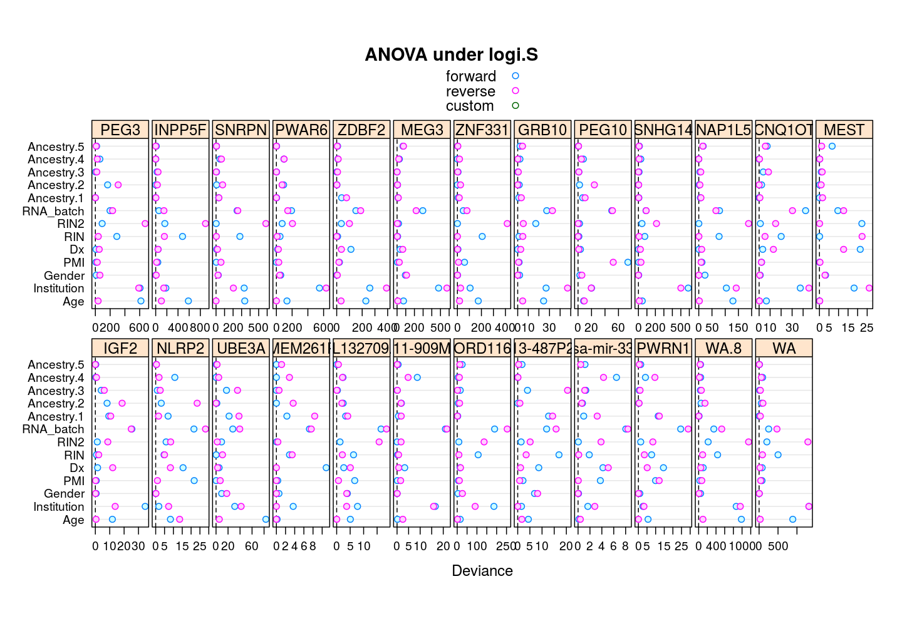
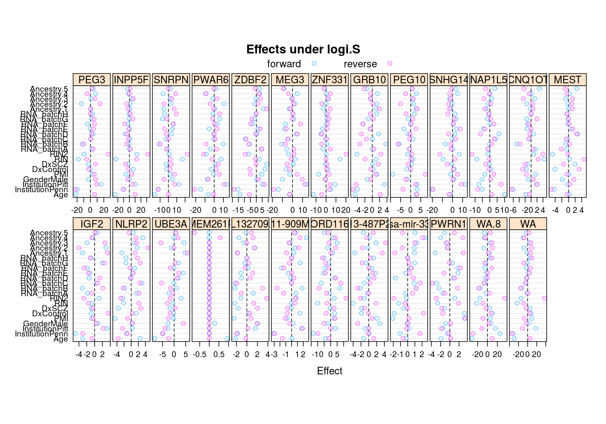
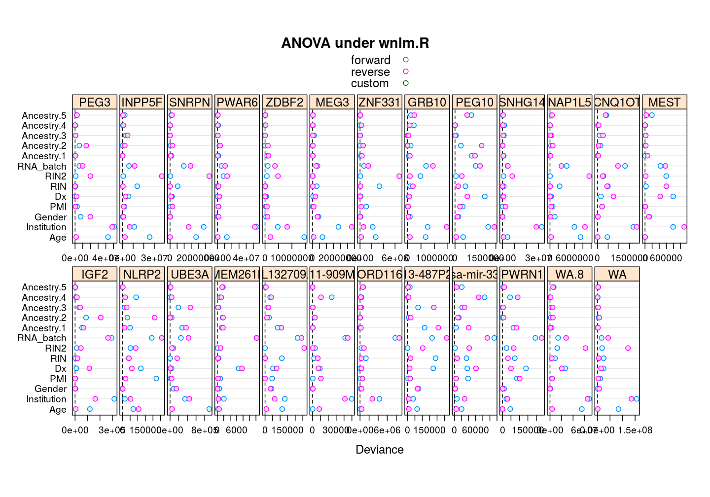
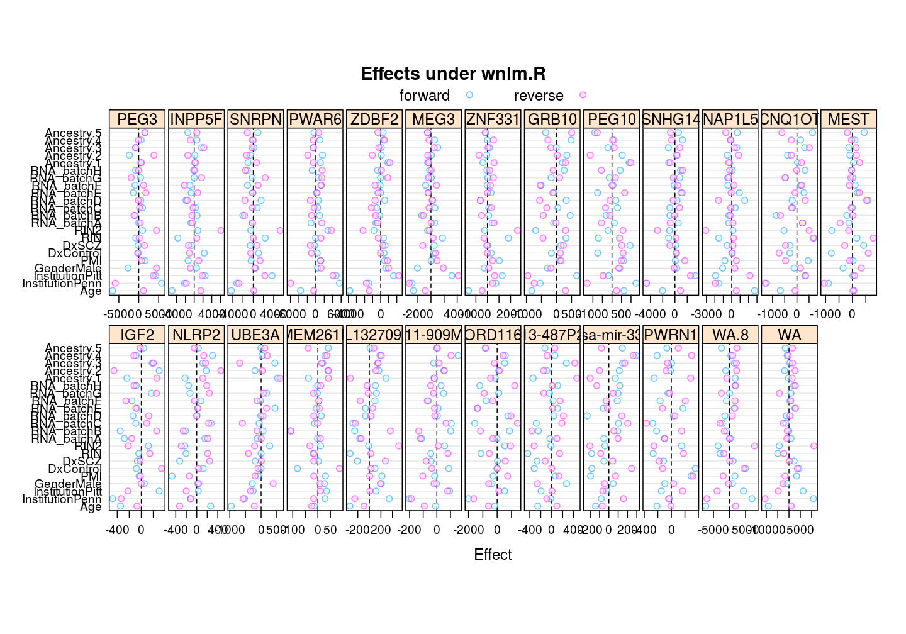
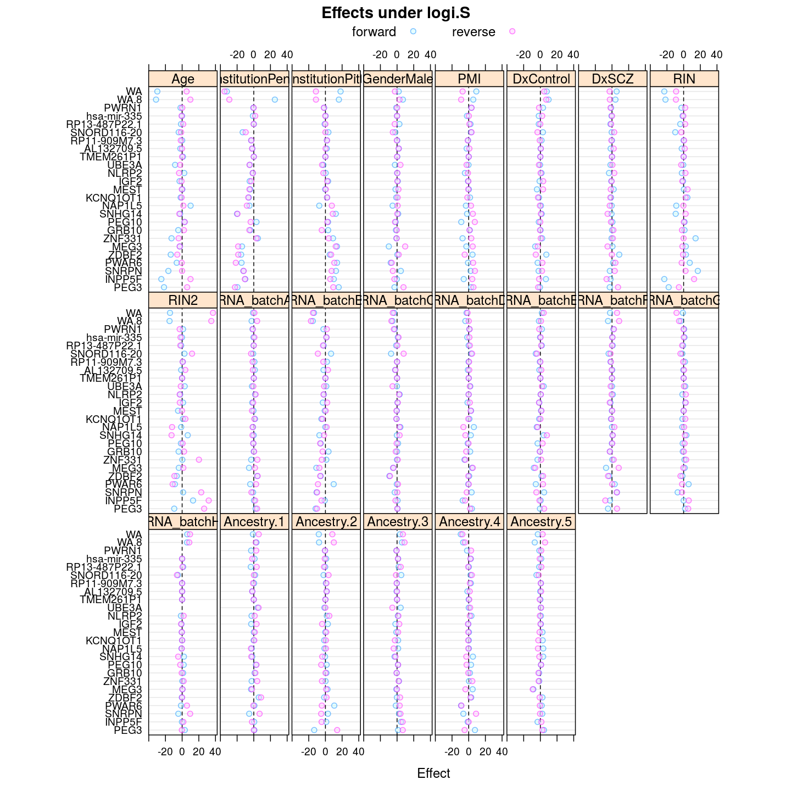
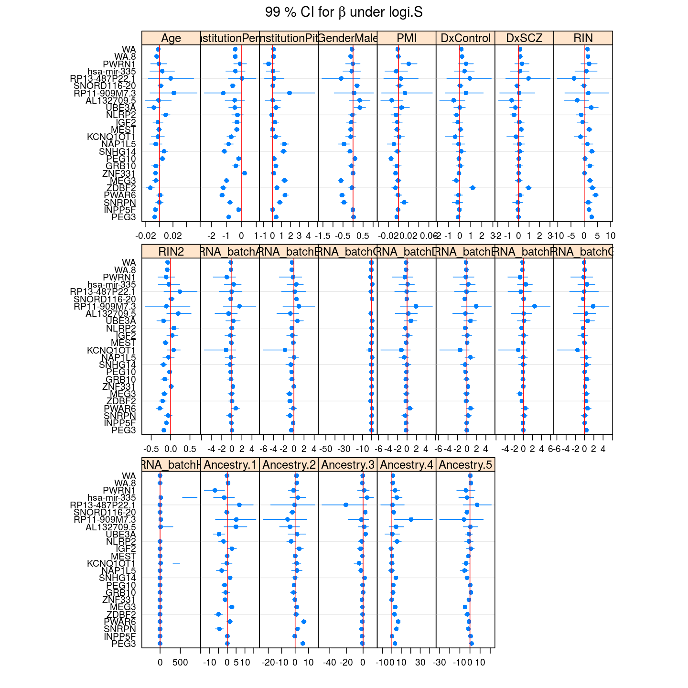
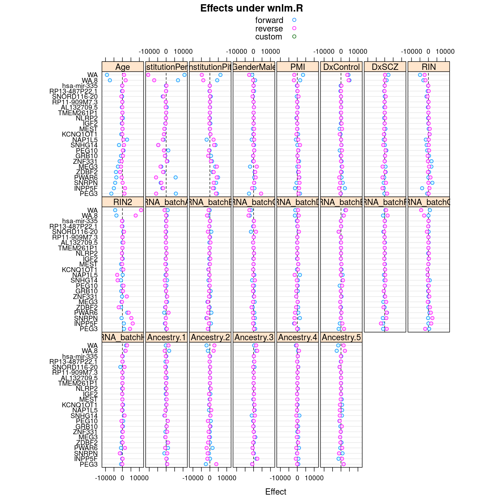

## Introduction

ANOVA and effects were used before...TODO

The least square estimates are given by $\hat{\beta} = (X^T X)^{-1} X^T y$.  Permuting the coefficients is equivalent to permuting the bases of the linear transformation $(X^T X)^{-1} X^T$ or, equivalently, permuting the *rows* of the corresponding matrix or, equivalently again, permuting the *columns* of the design matrix.  Therefore, when explanatory variables are reordered and the columns of the design matrix are permuted accordingly then the least square estimates still remain the same up to their relative order.

Take two permutations of explanatory variables:

1. **forward** has been used in all my and Ifat's previous analysis
2. the **reverse** of the above


## Preparation

Relevant scripts

```r
library(lattice)
library(latticeExtra)
```

```
## Loading required package: RColorBrewer
```

```r
source("~/projects/monoallelic-brain/src/import-data.R")
source("~/projects/monoallelic-brain/src/fit-glms.R")
opts_chunk$set(dpi = 144)
opts_chunk$set(fig.width = 10)
lattice.options(default.args = list(as.table = TRUE))
lattice.options(default.theme = "standard.theme")
```

Import data

```r
E <- get.predictors() # default arguments
Y <- get.readcounts(gene.ids = gene.ids, count.thrs = 0)
#nobs <- as.data.frame(lapply(list(unfiltered=Y, filtered=Y.f), function(y) sapply(y, function(x) sum(! is.na(x[[1]])))))
```

Fit both `wnlm.R` and `logi.S` using both the forward and the reverse order permutation.

```r
# e.vars defined in fit-glms.R
e.v <- list(forward = e.vars, reverse = rev(e.vars), custom = names(E)[1:13])
# exclude unweighed aggregates UA.8 and UA from fitting
to.fit.ids <- grep("^UA(.8)?$", names(Y), value = TRUE, invert = TRUE)
M <- lapply(list(wnlm.R = "wnlm.R", logi.S = "logi.S"),
            function(m) lapply(e.v,
                               function(v) do.all.fits(Y[to.fit.ids], preds = v, sel.models = m)[[1]]))
# a list of (sub)lists mirrioring the structure of M (sublists: forward or reverse)
f.ids <- lapply(M, lapply, function(m) ! sapply(m, is.null))
# the fit for TMEM261P1 has not converged under logi.S
f.ids$logi.S$forward["TMEM261P1"] <- FALSE
f.ids$logi.S$reverse["TMEM261P1"] <- FALSE
```

Consistent with the theory above, wherever the fit converged (with the exception of TMEM261P1), the order has no impact on the regression coefficients.  The next `R` expression compares coefficient estimates between forward and reverse under `logi.S` for every gene or aggregate and reports any difference:

```r
grep("TRUE", sapply(to.fit.ids, function(g) all.equal(coef(M$logi.S$forward[[g]]), coef(M$logi.S$reverse[[g]])[ names(coef(M$logi.S$forward[[g]])) ])), invert = TRUE, value = TRUE)
```

```
##                                TMEM261P1 
## "Mean relative difference: 1.508896e-08"
```

## Components of variation

ANOVA allows *direct* comparison of predictors (explanatory variables) by partitioning all explained/systematic variation in the response ($S$ or $R$) among them.  Similarly, the directly comparable effect of each of the $p$ regression coefficients on the response (an $n$-vector) can be obtained from QR decomposition of the response into a set of $n$ orthogonal vectors, in which a subset of $p$ vectors corresponds to the coefficients. 

In the above sentences "directly comparable" means that the effects are on a uniform scale for all predictors/coefficients for a given gene as that scale is closely related to the one on which the response varies.  But the total variation of the response $S$ itself shows variation across genes, which leaves two options in gene-gene comparisons: compare components of variation with or without correction for across gene variation of the total variance.  The first one will be referred below as **genes on uniform scale** and the second as **genes on relative scale**.

### Comparing predictors with genes on uniform scale


```r
A.long <- lapply(lapply(M, lapply, l.anova), reshape.2, type = "anova")
```


Under `logi.S`:


The same tendencies emerge under `wnlm.R`:


```r
Ef.long <- lapply(M, function(m) { x <- l.l.effects(m); x <- x[ ! x$Coefficient %in% "(Intercept)", ] })
```

Under `logi.S`:


Again, similar tendencies are observed under `wnlm.R`:


### Comparison with genes on relative scale









### Another view, genes on uniform scale

This display is meant to be comparable to a similarly structured trellis display of estimated regression coefficients.


```r
Betas <- lapply(M, function(m) { x <- get.estimate.CI(m$forward); x <- x[ ! x$Coefficient %in% "(Intercept)", ] })
```

#### Under logi.S






#### Under wnlm.R




