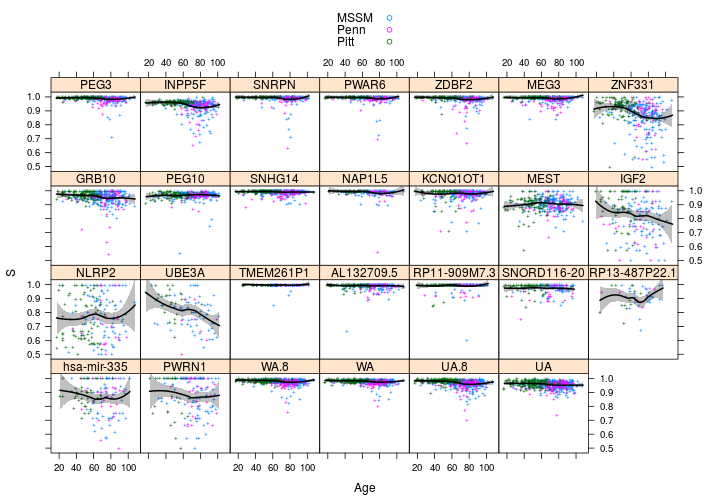
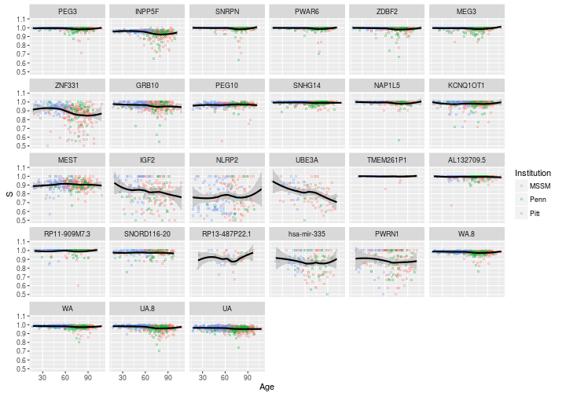
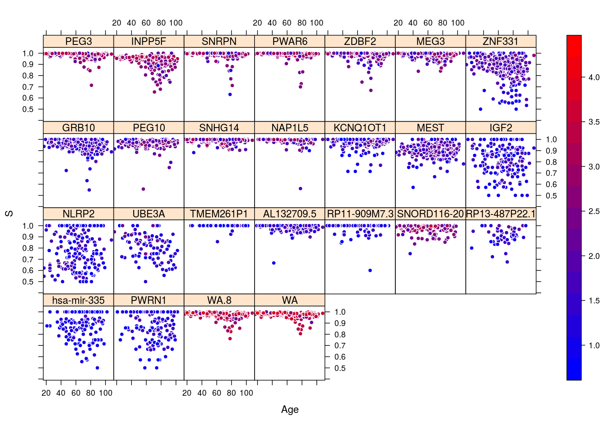
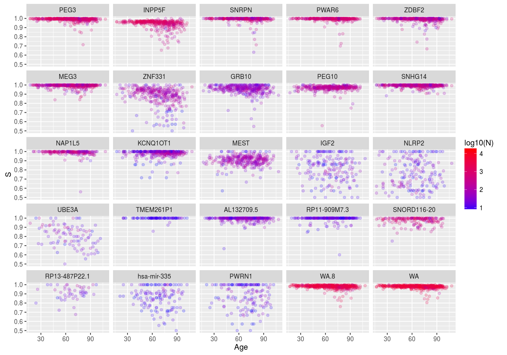
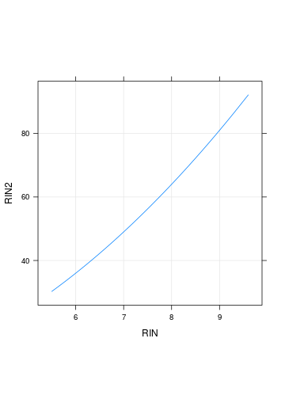
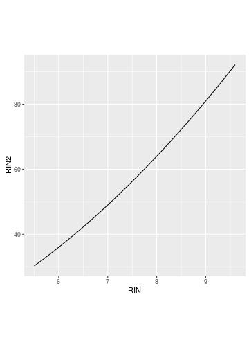
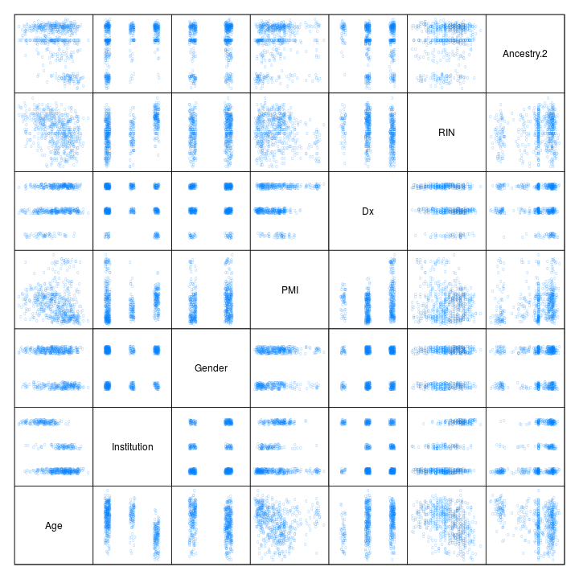
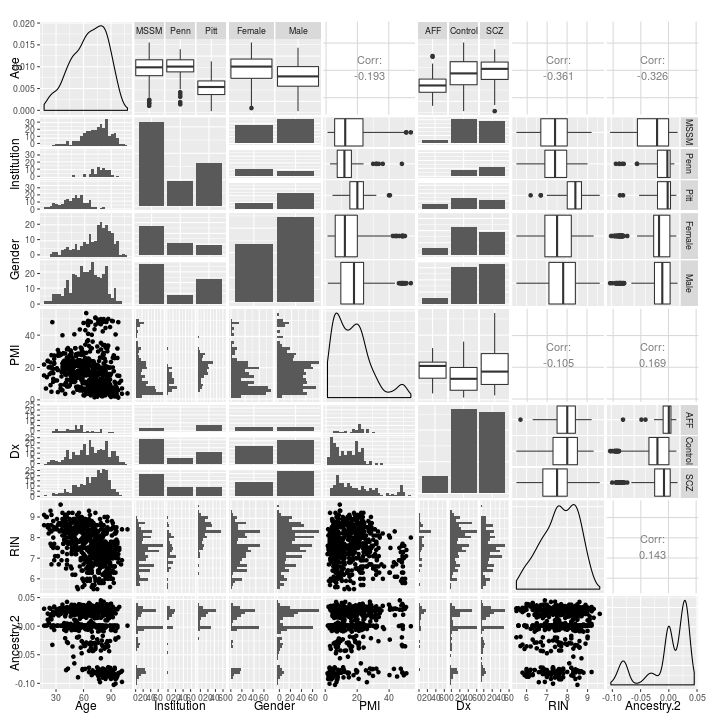

## Prepare data


## Dependence of $S$ on certain variables

### Dependence on gene, age, and institution

Implementation of the same plot both with the `lattice` and the `ggplot2` package.


```r
P <- list()
# lattice implementation
P$s.age.inst$lattice <-
    xyplot(S ~ Age | Gene, data = Y.long,
           subset = Gene %in% gene.ids,
           groups = Institution,
           panel = function(x, y, ...) {
               panel.xyplot(x, y, pch = 21, cex = 0.3, ...)
               panel.smoother(x, y, col = "black", lwd = 2, ...)
           },
           auto.key = list(title = "institution", columns = 3),
           par.settings = list(add.text = list(cex = 0.8)),
           ylab = "read count ratio, S",
           xlab = "age",
           aspect = "fill", layout = c(6, 5))
# ggplot2 implementation
g <- ggplot(data = Y.long, aes(x = Age, y = S))
g <- g + geom_point(pch = "o", aes(color = Institution))
g <- g + geom_smooth(method = "loess", color = "black")
g <- g + facet_wrap(~ Gene)
P$s.age.inst$ggplot2 <- g
plot(P$s.age.inst$lattice)
```



```r
plot(P$s.age.inst$ggplot2)
```



### Gene, age, and gender


```r
P <- list()
# lattice implementation
P$s.age.gender$lattice <-
    xyplot(S ~ Age | Gene, data = Y.long, groups = Gender,
           subset = Gene %in% gene.ids,
           panel = function(x, y, ...) {
               panel.xyplot(x, y, pch = 21, ...)
               #panel.smoother(x, y, col = "black", lwd = 2, ...)
           },
           par.settings = list(add.text = list(cex = 0.8),
                               superpose.symbol = list(cex = 0.5,
                                                       fill = trellis.par.get("superpose.symbol")$fill[c(2, 1)],
                                                       col = trellis.par.get("superpose.symbol")$col[c(2, 1)])),
           auto.key = list(title = "gender", columns = 2),
           ylab = "read count ratio, S",
           xlab = "age",
           aspect = "fill", layout = c(6, 5))
# ggplot2 implementation
g <- ggplot(data = Y.long, aes(x = Age, y = S))
g <- g + geom_point(pch = "o", aes(color = Gender))
g <- g + geom_smooth(method = "loess", color = "black")
g <- g + facet_wrap(~ Gene)
P$s.age.gender$ggplot2 <- g
plot(P$s.age.gender$lattice)
```


```r
#plot(P$s.age.gender$ggplot2)
```


```r
P$s.age$lattice <-
    xyplot(S ~ Age | Gene, data = Y.long,
           subset = Gene %in% gene.ids,
           par.settings = list(add.text = list(cex = 0.8),
                               strip.background = list(col = "gray90"),
                               plot.symbol = list(pch = 21, cex = 0.5, col = "black", fill = "gray", alpha = 0.5)),
           auto.key = list(title = "gender", columns = 2),
           ylab = "read count ratio, S",
           xlab = "age",
           aspect = "fill", layout = c(6, 5))
plot(P$s.age$lattice)
```


```r
update(P$s.age$lattice, layout = c(5, 6))
```


### Dependence on gene, age, and total read count $N$



## Associations between explanatory variables

### Deterministic association: RIN and RIN2



### Stochastic (statistical) associations

Both "scatter plot matrices" show the same set of pairwise associations (top: `lattice`, bottom: `ggplot2` and `GGally` packages).


